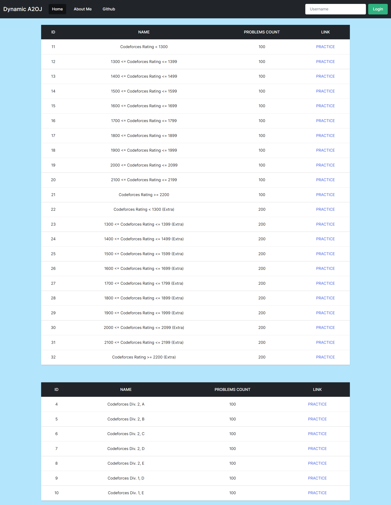
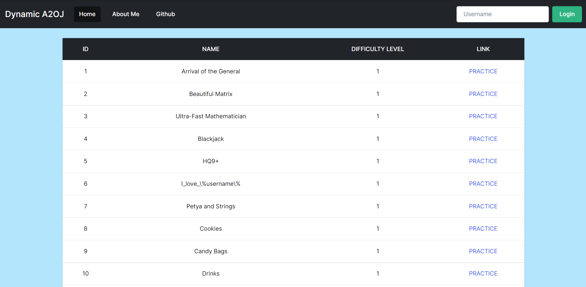
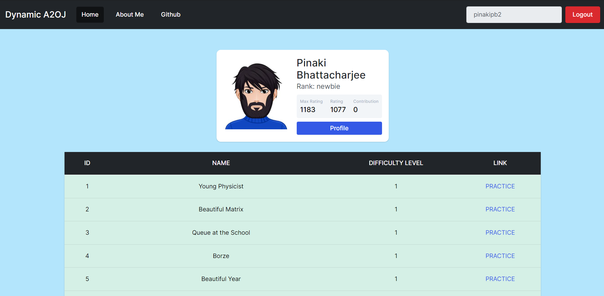
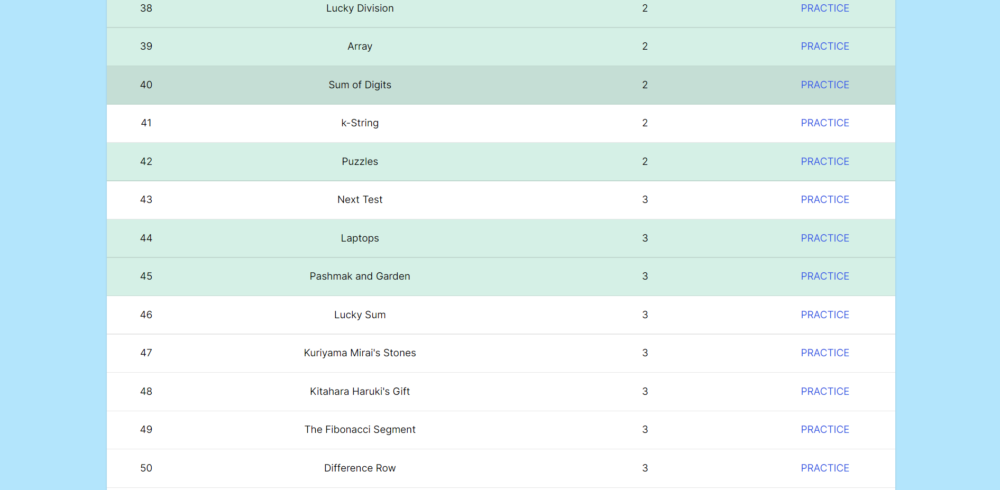

<h1 align="center">Dynamic A2OJ - Frontend</h1>

<p align="center">
  
  <br>
  <i>Dynamic A2OJ is the dynamic version of Static A2OJ
    <br> It is made using ReactJS front-end and NodeJS and ExpressJS back-end</i>
  <br>
</p>

<p align="center">
  <a href="https://dynamic-a2oj-pinakipb2.vercel.app/"><strong>https://dynamic-a2oj-pinakipb2.vercel.app</strong></a>
  <br>
</p>

## Screenshots

<p align="center">
  
</p>
<p align="center">
  
</p>
<p align="center">
  
</p>
<p align="center">
  
</p>

## Development Setup

### Prerequisites

- Install [Yarn] which includes [Yarn Package Manager][yarnpkg]

### Setting Up a Project

Create workspace:

```
mkdir [PROJECT NAME]
cd [PROJECT NAME]
```

Install all packages:

```
yarn install package.json
```

Run the application:

```
yarn start
```

**Love Dynamic A2OJ? Give our repo a star :star: :arrow_up:.**

[yarn]: https://classic.yarnpkg.com/en/
[yarnpkg]: https://classic.yarnpkg.com/en/docs/cli/add/
